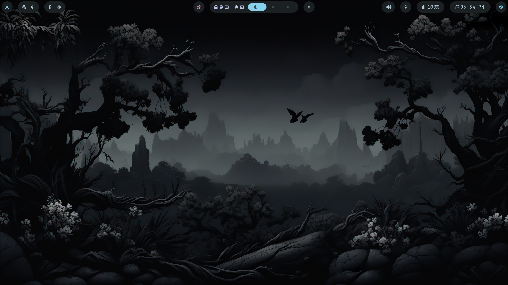

div align="center">

# Rafay's Hyprland Dotfiles



*Dark minimal Hyprland setup on CachyOS. Green accents, smooth animations, nothing unnecessary.*

</div>

---

## Stack

| Component | Tool |
|-----------|------|
| WM | Hyprland |
| Bar | Waybar |
| Terminal | Kitty |
| Shell | Fish + Starship |
| Launcher | Wofi |
| File Manager | Thunar |
| Wallpaper | swww + Waypaper |
| Lock Screen | Hyprlock |
| Idle Daemon | Hypridle |
| Fetch | Fastfetch |
| Login Manager | SDDM + Silent theme |
| Cursor | Bibata Modern Classic |
| Font | JetBrainsMono Nerd Font |

---

## Install

> Requires an Arch-based distro (Arch, CachyOS, EndeavourOS, Manjaro)

```bash
git clone https://github.com/Hirafay/Rafay-Hyprland-Arch
cd Rafay-Hyprland-Arch
./install.sh
```

The installer will:
- Auto-install `yay` if not found
- Install all dependencies
- Back up your existing configs
- Copy all dotfiles
- Set up cursor theme
- Set fish as default shell
- Optionally install SDDM + Silent theme
- Optionally download a wallpaper collection (~1GB)

---

## Keybinds

| Keybind | Action |
|---------|--------|
| `SUPER + RETURN` | Terminal |
| `SUPER + SPACE` | App launcher |
| `SUPER + Q` | Close window |
| `SUPER + E` | File manager |
| `SUPER + F` | Toggle floating |
| `SUPER + G` | Fullscreen |
| `SUPER + L` | Lock screen |
| `SUPER + W` | Wallpaper picker |
| `SUPER + V` | Clipboard history |
| `SUPER + S` | Swap window |
| `SUPER + 1-9` | Switch workspace |
| `SUPER + SHIFT + 1-9` | Move to workspace |
| `SUPER + HJKL` | Vim-style focus |
| `SUPER + Arrow keys` | Focus move |
| `Print` | Screenshot (area) |
| `SHIFT + Print` | Screenshot (screen) |

Super means the windows key dont get confused

License 
MIT
